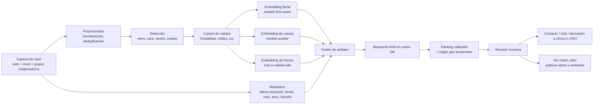
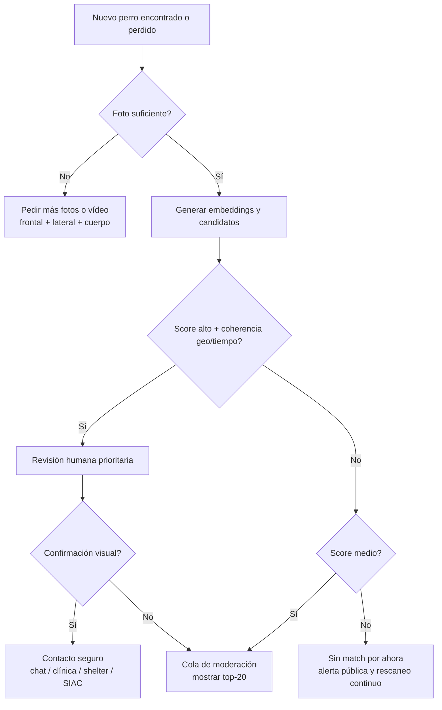

# Reidentificación visual de perros individuales con IA

## Resumen ejecutivo

Sí: **existen modelos y sistemas para reconocer perros individuales** y no se limitan a la clasificación por raza. La línea de trabajo va desde sistemas tempranos de reconocimiento facial canino con CNN hasta enfoques modernos de *re-identification* con aprendizaje métrico, ArcFace, *vision transformers*, CLIP/SigLIP ajustados, biometría de huella nasal y sistemas multimodales que combinan cara, cuerpo y metadatos. En la literatura consultada aparecen hitos claros: *Where Is My Puppy?* inauguró el reconocimiento facial para perros con redes específicas; DogFaceNet trasladó triplet loss al dominio canino; trabajos posteriores añadieron biometría blanda, cuerpo completo, invariancia al fondo y *foundation models* adaptados a mascotas. citeturn27view0turn7view11turn13view2turn7view2turn12view0turn15view5turn11view0turn7view1

La respuesta corta a si es “realista” lograr una reidentificación fiable en práctica es **sí, pero no como prueba automática concluyente**. En condiciones de *benchmark* controladas, la verificación canina puede ser muy fuerte: en PetFace, para perros, ArcFace alcanza **AUC 99,45%** en verificación de individuos no vistos, y el modelo entrenado en el subconjunto canino de PetFace obtiene **98,30%** de media en verificación fina dentro de las 10 razas más frecuentes; en un estudio posterior con SigLIP2-Giant ajustado, DogFaceNet llega a **ROC AUC 0,9926**, **EER 0,0326** y **Top-1 0,7475**. Pero la **identificación abierta** y el *retrieval* real siguen siendo bastante más difíciles que la verificación binaria. citeturn8view4turn8view3turn11view0

La mejor lectura práctica es esta: la IA visual **sirve muy bien como motor de búsqueda, ranking y priorización de candidatos**, y mucho peor como “veredicto” autónomo. La evidencia de campo lo confirma. En una campaña real de vacunación antirrábica en Tanzania, la aplicación tuvo **98,9% de especificidad** y **76,2% de sensibilidad** en la clasificación operativa; el algoritmo de reconocimiento facial emparejó correctamente **249 de 251** perros vacunados y microchipados, pero el rendimiento de extremo a extremo cayó por **mala calidad de foto** y **distorsión de color asociada a la luz**, además de problemas operativos al capturar imágenes de perros inquietos. citeturn19view0turn19view2

Para un caso de uso como pérdida o robo de perros en el Algarve, la conclusión más fuerte es que **no conviene plantearlo como sustituto del microchip ni como producto aislado desde cero**. Conviene plantearlo como **capa de coordinación y búsqueda visual sobre redes ya existentes**: grupos locales, clínicas veterinarias, CRO/canis/gatis, asociaciones, publicaciones sociales y flujo SIAC. En Portugal, los perros, gatos y hurones deben estar identificados y registrados en SIAC, y el titular debe comunicar la desaparición en **15 días**; por tanto, cualquier piloto serio debería complementar ese flujo, no competir con él. citeturn20search8turn35search0turn35search3turn35search12

## Qué problema estamos intentando resolver

Técnicamente, aquí no se trata de “clasificar razas”, sino de **re-identificar un individuo concreto** a partir de una o varias imágenes nuevas. Eso puede formularse de tres maneras: **verificación** uno-a-uno (“¿es el mismo perro?”), **identificación cerrada** (“¿cuál es dentro de una base conocida?”) y **identificación abierta / recuperación** (“dame los candidatos más probables entre miles de perfiles y publicaciones”). La literatura reciente ya distingue explícitamente entre reconocer individuos *vistos* y verificar individuos *no vistos*, que es justamente el problema que importa en pérdida/robo. citeturn8view5turn8view4turn11view7

Las dimensiones técnicas que más rompen estos sistemas son conocidas. Los trabajos sobre *animal re-identification* destacan la **variabilidad de pose**, la **variabilidad ambiental**, la escasez de datos y las diferencias profundas respecto al *person re-identification* clásico. Para perros en entornos no controlados, además, se añaden **ángulos de cámara**, **fondo**, **iluminación**, **baja resolución** y **vídeo pobre**; el artículo BIFOR muestra precisamente que muchos métodos SOTA aprenden atajos del fondo y rinden mal cuando cambian las cámaras y el entorno. El conjunto Pet911, compilado a partir de anuncios reales de mascotas perdidas, enfatiza que las fotos de este dominio ya nacen con gran variabilidad de calidad, iluminación y pose. citeturn11view7turn15view5turn7view6

La siguiente tabla resume las dimensiones críticas del problema y su importancia práctica.

| Dimensión | Impacto real en pérdida/robo | Lo que sugieren las fuentes |
|---|---|---|
| Pose y oclusión | El perro rara vez mira frontalmente; pueden verse solo hocico, media cara o cuerpo parcial | La variabilidad de pose es un reto central en *animal re-ID*; en sistemas operativos se compensa combinando cara y cuerpo citeturn11view7turn12view5 |
| Iluminación y calidad de captura | Fotos nocturnas, móviles baratos, desenfoque, contraluces | En Tanzania la sensibilidad bajó por fotos pobres y distorsión de color por la luz citeturn19view0turn19view2 |
| Fondo y cámara | Modelos que “aprenden” el contexto en vez del perro | BIFOR demuestra dependencia del fondo y propone invariancia para mejorar *rank-1* en escenario cruzado citeturn15view5 |
| Similitud entre individuos | Perros de la misma raza o del mismo color pueden parecerse mucho | PetFace introduce verificación fina por raza porque el problema dentro de raza es especialmente duro citeturn8view3 |
| Baja resolución / vídeo | CCTV, *camera traps*, publicaciones recortadas | BIFOR aborda explícitamente vídeo de baja calidad y múltiples cámaras citeturn15view5 |
| Cambios de edad, pelaje o aspecto | Cortes de pelo, muda, barro, pérdida de peso, envejecimiento | Las plataformas comerciales usan color, atributos del pelaje y marcas distintivas; por inferencia, cambios físicos pueden degradar el *matching* visual si el sistema depende de esos atributos citeturn19view7turn32view1 |
| Sesgo de dataset | Datasets pequeños, frontales y limpios sobrestiman resultados | PetFace subraya que muchos datasets anteriores tenían menos de 100 individuos; OpenAnimals insiste en la escasez y heterogeneidad de datos animales citeturn7view0turn11view7 |
| Microchip frente a visión | El chip no depende de la apariencia; la visión sirve cuando no hay escaneo | En Portugal el microchip/SIAC es obligatorio; Petco Love Lost además integra búsqueda por microchip y foto-matching citeturn20search8turn35search0turn34view0 |

La comparación con el microchip es importante. El microchip sigue siendo el **identificador fuerte** cuando un profesional puede escanear al animal; la visión sirve de forma especialmente valiosa cuando el perro aparece en **fotos sociales**, publicaciones de vecinos, refugios o anuncios donde no existe acceso inmediato al chip. La propia Petco Love Lost presenta su sistema como complementario al microchip, no sustitutivo, y en Portugal el flujo legal y operativo del perro perdido pasa por SIAC. citeturn34view0turn35search0turn35search6

## Qué dice el estado del arte

El patrón dominante en la literatura es el de **aprender un embedding**: una representación vectorial donde imágenes del mismo perro quedan cerca y las de perros distintos quedan lejos. Ese enfoque aparece ya en DogFaceNet, que lleva la lógica de FaceNet y el **triplet loss** al reconocimiento canino, y sigue presente en trabajos posteriores que usan **Siamese networks**, triplet loss, ArcFace o pérdidas afines. DogFaceNet se publicó como implementación abierta y su dataset curado/alineado quedó en Zenodo. citeturn7view11turn26view3turn26view1

La fase más reciente desplaza el centro de gravedad hacia dos familias. La primera son los enfoques de **aprendizaje métrico específico de dominio**, con ArcFace o triplet loss, entrenados en grandes colecciones de identidades. En PetFace, ArcFace supera a Softmax, Center y Triplet en reidentificación y verificación, y un entrenamiento conjunto mejora la media global. La segunda son los **encoders preentrenados de gran capacidad** —CLIP, DINOv2, SigLIP, MegaDescriptor— seguidos de *fine-tuning* o uso como extractor de características. WildlifeDatasets introdujo MegaDescriptor como modelo fundacional para reidentificación animal y reportó que supera con claridad a CLIP y DINOv2 en múltiples datasets animales; OpenAnimals y trabajos posteriores revisitan y adaptan técnicas de *person re-ID* al dominio animal. citeturn8view4turn7view1turn11view7

En perros, la lección no es solo “más grande es mejor”, sino “**el preentrenamiento general ayuda, pero el ajuste al dominio perro/mascota sigue importando mucho**”. En PetFace, los modelos entrenados en el subconjunto canino superan a CLIP y MegaDescriptor en verificación fina dentro de raza. En 2026, un estudio de ablación sobre identificación de mascotas muestra que un **SigLIP2-Giant** ajustado para identificación animal logra resultados muy fuertes en DogFaceNet, lo que sugiere que la combinación “modelo fundacional + *fine-tuning* específico” es hoy una de las opciones más sólidas. citeturn8view3turn11view0

No toda la señal relevante está en la cara. Un trabajo de 2023 sobre identificación de mascotas combinó **cara, cuerpo y biometría blanda** —raza, sexo, edad, atributos— y mejoró del 80% en cara sola a 86,5% con cara+cuerpo y a 92% usando biometría blanda. Otro trabajo anterior mostró que fusionar “biometría dura” facial con “biometría blanda” mejoraba la identificación de perros de 78,09% a 84,94%. Esto es muy relevante para un producto real: cuando la foto facial falla, el **cuerpo, la silueta, el patrón del pelaje, el tamaño y los metadatos** aportan señal útil. citeturn12view5turn13view2

La biometría de **huella nasal** también es real. Varios trabajos sostienen que la nariz canina tiene una pauta única y estable a lo largo del tiempo: un estudio de 2021 utilizó 180 imágenes de 60 perros y un conjunto ampliado de 278 imágenes de 70 perros de 19 razas para concluir unicidad e invariancia; otro trabajo longitudinal sobre 10 beagles concluyó que el patrón nasal se forma hacia el segundo mes y permanece invariante durante el periodo observado. A nivel de modelos, se han propuesto DNNet tipo Siamese y métodos con segmentación en dos etapas del área nasal. El problema práctico es que **la huella nasal requiere capturas cercanas y bastante frontales**, por lo que sirve muy bien para registro o verificación en mano, pero mucho peor para fotos de calle o redes sociales. citeturn40search0turn40search3turn40search1turn39search0turn39search1

La **augmentación de datos** ya aparece como práctica estándar en estudios aplicados: rotación, recortes, volteos, brillo, contraste y saturación se usan para mejorar robustez. En cambio, sobre **datos sintéticos** específicos para recuperación de perros perdidos, la evidencia localizada en esta revisión es todavía incipiente: hay interés investigador en generación personalizada y representación personalizada, pero no encontré, entre las fuentes primarias consultadas, una demostración de despliegue que convierta hoy a los datos sintéticos en la palanca principal para un MVP de campo. citeturn12view3turn4search8

## Qué muestran los papers y benchmarks

### Papers clave

| Trabajo | Método | Dataset | Resultado relevante | Lectura práctica |
|---|---|---|---|---|
| Moreira et al. *Where Is My Puppy?* | CNNs BARK/WOOF frente a reconocedores faciales humanos | Flickr-dog y Snoopybook | Reconocedores humanos: hasta 60,5%; BARK: 81,1%; WOOF: 89,4% | El reconocimiento de perros no es una extensión trivial del humano; una red específica mejora mucho citeturn27view0 |
| Mougeot et al. / DogFaceNet | Triplet loss + CNN/ResNet-like | DogFaceNet | Demuestra viabilidad y deja código/dataset abiertos | Punto de partida histórico canónico para cara de perro citeturn7view11turn26view3 |
| Lai et al. | Cara + biometría blanda | Dos datasets de 2 razas | 78,09% sin biometría blanda; 84,94% con ella | Los metadatos bien usados ayudan bastante citeturn13view2 |
| Yoon et al. | Mejora del espacio vectorial para dog face ID | Dataset/método de DogFaceNet | Reproduce baseline de 65% y reporta mejora de ~4 puntos | Las pérdidas y la geometría del embedding importan mucho citeturn7view2 |
| Azizi y Zaman | Sistema multimódulo cara+cuerpo+soft biometrics | Dataset propio + BC SPCA + Flickr-dog + otros | Cara 80%; cuerpo 81%; cara+cuerpo 86,5%; con biometría blanda 92%; top-10 100% | Muy útil para producto real, pero con validación externa limitada citeturn12view0turn12view5 |
| Shinoda y Shiohara / PetFace | ResNet-50 + ArcFace sobre gran dataset multiespecie | PetFace | Dog Top-1 77,86%; Dog AUC 99,45%; verificación fina canina 98,30% media | Verificación fuerte, identificación abierta bastante más difícil citeturn8view2turn8view4turn8view3 |
| Neto et al. / BIFOR | Re-ID invariante al fondo | YT-BB-Dog + Sibetan | Mejora >9 puntos de *rank-1* sobre baseline en Sibetan | En campo, el sesgo de fondo es un enemigo real citeturn15view5turn11view9 |
| Kudryavtsev et al. | Ablación de encoders; SigLIP2 ajustado | DogFaceNet + Pet911 | En DogFaceNet: AUC 0,9926; EER 0,0326; Top-1 0,7475 | Los grandes encoders ajustados ya son competitivos para perro/gato individual citeturn11view0 |

La conclusión empírica más útil de esa tabla es que **hay dos niveles de dificultad distintos**. La **verificación** —comparar dos imágenes y decidir si son el mismo perro— puede alcanzar números muy altos en entornos razonables. La **identificación abierta**, que es lo que importa cuando comparas un perro encontrado con miles de anuncios y perfiles, sigue siendo claramente más dura y debe tratarse como un problema de ranking y revisión, no de clasificación absoluta. citeturn8view4turn11view0

### Datasets y benchmarks que sí merecen atención

| Dataset | Qué contiene | Tamaño | Diversidad / valor | Licencia o disponibilidad |
|---|---|---:|---|---|
| DogFaceNet | Caras caninas alineadas para identificación | 1.393 identidades alineadas; 8.363 imágenes según PetFace; Zenodo describe 2.522 carpetas en bruto y 1.393 carpetas alineadas | Benchmark histórico para cara de perro | Zenodo CC-BY 4.0 citeturn8view1turn26view3turn26view1 |
| Flickr-dog | Caras de perros de Flickr | 42 perros; 374 imágenes | Muy pequeño; útil históricamente, insuficiente para despliegue moderno | El paper original lo describe como imágenes Flickr bajo Creative Commons; conviene verificar reutilización exacta por versión citeturn27view0turn25search5 |
| PetFace | Dataset facial multiespecie de gran escala | 257.484 individuos; 1.012.934 imágenes; 13 familias; 319 razas | Gran salto de escala; permite vistos/no vistos y evaluación fina por raza | Repositorio indica uso **solo para investigación no comercial** citeturn7view0turn8view1turn25search15 |
| YT-BB-Dog | Re-ID canino a partir de vídeo de YouTube | 2.723 perros; 27.036 imágenes | Bueno para robustez y sesgos de fondo | Descarga pública; no identifiqué licencia explícita en la página consultada citeturn11view9 |
| Sibetan | Re-ID cruzando cámaras en entorno real | 59 perros; 1.755 imágenes | Mucho más cercano al caso de campo | Descarga pública; licencia no explicitada en la página consultada citeturn11view9 |
| Pet911 dataset | Casos reales de mascotas perdidas del dominio web | 22.050 animales; 65.961 fotos | Muy valioso porque refleja variabilidad real de anuncios de pérdida | Encontrado en paper; disponibilidad/licencia pública no clara citeturn7view6 |
| DogFLW | *Landmarks* faciales caninos | 3.274 imágenes anotadas; 46 *landmarks* | Útil para alineación y calidad, no para re-ID final | Disponible bajo petición razonable según el trabajo citeturn14academia23 |

Hay un mensaje estratégico importante aquí. Los primeros datasets de perros eran demasiado pequeños, sesgados y limpios; PetFace nace precisamente para corregir ese cuello de botella y lo hace a escala muy superior. Pero incluso PetFace no resuelve del todo el caso “perro perdido en fotos malas del mundo real”, que está mejor representado por Pet911 o por escenarios tipo Sibetan. Para un piloto operativo, **la fuente de datos importa tanto como la arquitectura**. citeturn7view0turn7view6turn15view5

## Productos, proyectos abiertos y casos de campo

### Productos, APIs y proyectos abiertos

| Producto / proyecto | Tipo | Capacidades | Limitaciones más claras |
|---|---|---|---|
| Petco Love Lost | Plataforma operativa | Búsqueda gratuita con una foto; base centralizada; alertas compartibles; búsqueda por microchip; integración con más de 3.300 shelters; socios como Nextdoor y Neighbors by Ring | EEUU; modelo cerrado; sin *benchmark* público auditado; depende de que la red suba fotos y casos citeturn19view6turn19view7turn19view5turn34view0 |
| Petnow / Petify | App + SaaS B2B | Registro, verificación e identificación; captura de huella nasal de perro o cara de gato; SDK/API/Admin Console | Propietario; falta evaluación pública comparable; alertas de mascotas perdidas indicadas como disponibles en Corea citeturn16view1turn16view2turn7view9 |
| Pet911 / PetBot | Plataforma comercial | IA que compara más de 130 identificadores; escaneo 24/7; difusión social; perfiles previos; QR | La evidencia es sobre todo autodeclarada por el proveedor; métricas y “reuniones” no están auditadas públicamente en lo consultado citeturn32view0turn32view1 |
| Finding Rover | Precursor histórico | Reconocimiento facial para perdidos/encontrados | Hoy importa sobre todo como antecedente; la tecnología fue integrada en el ecosistema actual de Petco Love Lost citeturn33search7turn34view0 |
| DogFaceNet | Código/dataset abierto | Baseline canino con triplet loss y dataset abierto en Zenodo | Ya no es SOTA; dataset pequeño frente a alternativas recientes citeturn7view11turn26view3 |
| WildlifeDatasets + wildlife-tools | Open source | Repositorio de datasets, extracción de rasgos, recuperación, entrenamiento y uso de MegaDescriptor/WildFusion | Generalista de animales; requiere adaptación a perros/mascotas | citeturn24search4turn24search0turn24search10 |
| OpenAnimals | Open source | *Codebase* para Animal Re-ID basada en FastReID y WildlifeDatasets; ARBase | Orientado a investigación; no es producto final de calle | citeturn24search1turn11view7 |
| BIFOR | Open source | Método y pipeline para re-ID canino robusto a fondo en vídeo/cámaras cruzadas | Evidencia centrada en escenarios concretos de vídeo/camera trap | citeturn24search6turn15view5 |

La lección común de los productos que sí están funcionando no es “tenemos el mejor modelo”, sino “**agregamos fuentes de datos, difundimos alertas, centralizamos listados y mantenemos al humano en el bucle**”. Petco Love Lost insiste en una base centralizada con shelters y plataformas vecinales; Pet911 mezcla IA, geografía, voluntariado y distribución social. Esa es una pista muy fuerte para un piloto en Algarve: **tecnologizar la red local existente** es más prometedor que abrir otra red nueva compitiendo con ella. citeturn19view6turn19view5turn34view0turn32view1

### Casos de campo y éxitos reales

Hay casos operativos reales, no solo demos. Petco Love Lost afirma haber facilitado **casi 100.000 reuniones** en abril de 2025 y **250.000** en abril de 2026; además, la AAHA describe su base como una infraestructura de gran escala con más de 3.000 shelters, integración de datos y búsqueda gratuita por una sola foto. Estas cifras son de la propia organización y deben leerse como **claims institucionales**, no como auditoría independiente, pero muestran una implantación real, sostenida y amplia. citeturn19view5turn19view3turn34view0

Los ejemplos concretos son útiles porque ilustran el patrón de uso correcto. En la historia de **Millie**, un veterinario subió la foto y el microchip de la perra encontrada; el tutor creó el caso perdido poco después, recibió un *image match* y una alerta por microchip en cuestión de minutos, y la reunión se produjo en **14 horas y 43 minutos**. En la historia de **Sweetie**, la coincidencia por foto apareció tras casi dos meses y a 33 millas. El producto también recopila otros casos de perros reunidos tras días o meses. Eso sugiere que la tecnología funciona especialmente bien como **servicio de correlación entre distintos puntos de entrada** —vecinos, vet, shelter, tutor—, no solo como clasificador de imágenes. citeturn34view0turn19view4turn19view3turn16view5

El caso de Tanzania es todavía más instructivo para un piloto serio porque es una **evaluación de campo publicada**. La parte fuerte del sistema fue la discriminación algorítmica; la parte débil fue la operación: captura de imágenes con perros deambulantes, movimiento del animal, ansiedad durante la fotografía, calidad desigual y luz difícil. En otras palabras, el cuello de botella real no fue “falta de IA”, sino **calidad del proceso de adquisición**. Esta es probablemente la lección más importante para un producto local de perros perdidos: la UX de captura importa casi tanto como el modelo. citeturn19view0turn19view2

## Qué es realista en despliegue

La expectativa correcta no es “identifica perros automáticamente con certeza forense”, sino “**encuentra candidatos muy probables rápido y reduce el trabajo humano**”. En un sistema real, yo trataría el *matching* visual como una **herramienta de búsqueda con *ranking***. La salida adecuada no es “es este perro” sino “estos son los 10 candidatos más plausibles con la evidencia visual y contextual que tenemos”. Eso encaja con cómo operan Petco Love Lost y con cómo reporta resultados el paper multimodal de 2023, donde el valor del sistema está también en que el animal correcto aparezca muy arriba en las recomendaciones. citeturn19view7turn12view5

El control de **falsos positivos** es crítico. En el caso de un perro robado o perdido, un falso positivo consume tiempo, genera llamadas erróneas y puede dañar la confianza de grupos locales o refugios. Un falso negativo, por su parte, significa que el perro correcto no sale arriba y la familia pierde horas o días. Por eso el objetivo de producto no debería ser maximizar una única *accuracy*, sino optimizar la combinación de **precisión alta en la parte superior del ranking**, **carga razonable de revisión** y **tiempo a coincidencia útil**. La literatura que diferencia Top-1, Top-k, AUC y EER ya apunta exactamente a ese enfoque. citeturn8view2turn8view4turn11view0

El **humano en el bucle** no es opcional. Debe haber revisión visual antes de contactar, especialmente cuando el caso es sensible o puede implicar robo. La revisión debe comparar lado a lado varias fotos del perro perdido y del encontrado, y mostrar también señales contextuales: lugar, hora, coloración, rasgos del hocico, orejas, pecho, cola, arnés/collar, tamaño, sexo, condición corporal y texto del anuncio. Petco Love Lost y Pet911 no dependen solo de la imagen: combinan imagen con atributos, localización y difusión/red humana. citeturn19view7turn32view1

En privacidad y legalidad, hay un matiz importante. El RGPD protege datos de **personas físicas** y define “dato biométrico” como dato personal resultante del tratamiento técnico de rasgos físicos o conductuales de una persona física que permita su identificación. De ello se desprende, **como inferencia jurídica básica**, que el embedding visual de un perro no es por sí solo una categoría especial del artículo 9; pero el expediente completo sí procesará datos personales del tutor —nombre, teléfono, localización, historial de mensajes, geografía del domicilio o del último avistamiento— y por tanto **sí entra de lleno en RGPD**. Además, la EDPB destaca que el uso de tecnología de reconocimiento facial conlleva riesgos elevados y exige necesidad, proporcionalidad, minimización y medidas reforzadas. citeturn23view0turn21search7

Para Portugal, la recomendación operativa es aún más clara: **no reemplazar el flujo microchip/SIAC**. Hay obligación de identificación y registro en SIAC y de comunicar desaparición en 15 días; además, SIAC publica animales perdidos/encontrados y permite generar anuncio/cartel. Visual matching debe actuar como capa adicional sobre ese sistema y sobre las redes locales de clínicas y CRO/caniles, no como base sustitutiva. citeturn20search8turn35search0turn35search3turn35search4turn35search7

Los modos de fallo más previsibles, a la vista de la evidencia, son estos: **sesgo al fondo**, **cambios de cámara**, **fotografías oscuras o movidas**, **perros de la misma raza muy parecidos**, **capturas parciales**, **errores del operador**, y probablemente —esto ya como inferencia de producto— **cambios de corte de pelo, barro, heridas o adelgazamiento** si el modelo depende mucho de atributos de pelaje. En cambio, no encontré en las fuentes primarias revisadas una evaluación seria de robustez frente a imágenes manipuladas o generadas por IA en este caso de uso; trataría ese vector como riesgo abierto y no resuelto. citeturn15view5turn19view0turn8view3turn19view7turn32view1

## Arquitectura recomendada para un MVP en Algarve

La arquitectura recomendable para un piloto no es la de una sola red “mágica”, sino la de un sistema de búsqueda visual y verificación asistida.

Mi recomendación práctica para el *stack* sería: un **servicio de ingesta** sencillo, detector canino y de cara/hocico, un **modelo principal de embeddings faciales fine-tuned** sobre datos de mascotas, una rama secundaria de **cuerpo completo**, una rama de **huella nasal opcional** para registros de alta calidad, y una **vector DB** para recuperación rápida. No empezaría con un modelo exótico propio; empezaría con un encoder fuerte y disponible hoy —por ejemplo, una variante tipo SigLIP/ViT ajustada a mascotas— y una capa de fusión de señales. Esta recomendación está alineada con la evidencia reciente: el mejor rendimiento viene de embeddings potentes, ajuste al dominio y mezcla de señales, no de una sola fotografía frontal desnuda. citeturn11view0turn12view5turn8view3

El flujo de decisión debería ser gradual.

En evaluación, separaría desde el principio **métricas técnicas** y **métricas operativas**. Técnicas: **Precision@1**, **Recall@10/20**, **MRR**, **ROC-AUC**, **EER**, **FMR/FNMR** y curvas de calibración por calidad de imagen. Operativas: tiempo medio hasta primer candidato útil, porcentaje de casos con el verdadero match en top-10, tiempo de revisión por moderador, tasa de contactos erróneos y porcentaje de reuniones facilitadas. Esa separación es importante porque el estudio de Tanzania mostró que un buen algoritmo no garantiza un buen sistema operativo. citeturn11view0turn8view4turn19view0

Para el piloto del Algarve, mi recomendación sería **no construir primero una red social nueva**, sino una **infraestructura de apoyo** para quienes ya están trabajando. El modelo de éxito observable lo respaldan Petco Love Lost y Pet911: centralizar casos de múltiples fuentes, buscar por foto, añadir geografía/tiempo, empujar alertas y coordinar personas. Traducido a Algarve, eso significa firmar acuerdos ligeros con **grupos de Facebook locales, clínicas veterinarias, CRO/canis/gatis municipales, asociaciones de protección y perfiles vecinales** para que usen una misma ficha de caso y un mismo motor de búsqueda visual. citeturn19view6turn19view5turn34view0turn32view1

Concretamente, para un piloto sensato haría esto. Primero, **modo sombra**: ingerir casos de grupos colaboradores con permiso, sin notificar automáticamente a nadie, y medir durante algunas semanas si el sistema coloca el candidato correcto entre los primeros. Segundo, **modo moderado**: mostrar candidatos a dos o tres moderadores humanos entrenados. Tercero, **modo operativo**: alertas automáticas solo cuando se cumplan simultáneamente un umbral alto de similitud, coherencia geográfica y revisión humana positiva. En paralelo, obligaría a capturar siempre, si es posible, una foto frontal, otra lateral, una de cuerpo entero y, cuando el animal esté en mano, una secuencia corta de vídeo o foto del hocico. Esa captura disciplinada probablemente dará más retorno que meses de cambio de arquitectura. citeturn19view0turn12view5turn15view5

## Preguntas abiertas y conclusión

Quedan preguntas abiertas importantes. La primera es la **robustez longitudinal**: hay evidencia aceptable para huella nasal y evidencia razonable para cara/cuerpo, pero no encontré una evaluación pública amplia y auditada de reidentificación de perros perdidos durante muchos meses con cambios fuertes de pelo, edad, peso o estado físico. La segunda es la **robustez adversarial**: casi no hay evaluación pública seria frente a imágenes manipuladas, reutilizadas o generadas con IA para este caso de uso. La tercera es la **comparabilidad de productos**: las páginas comerciales publican cifras útiles para entender capacidad, pero rara vez con protocolo de evaluación público y reproducible. citeturn40search3turn40search1turn32view1turn19view3

La conclusión práctica, para tomar decisiones, es bastante nítida. **Sí merece la pena construir algo**, pero no “un reconocedor definitivo de perros robados”. Lo que merece la pena es un **sistema de búsqueda visual asistida**, con *embeddings* buenos, control fuerte de calidad de captura, fusión con metadatos, revisión humana y acoplamiento al flujo SIAC/microchip. Ese sistema puede reducir mucho el tiempo de búsqueda, dar más visibilidad a casos, conectar publicaciones dispersas y ayudar a grupos locales a trabajar mejor. Es justo el tipo de problema donde la tecnología suma más cuando **ordena, correlaciona y prioriza**, no cuando pretende sustituir el conocimiento de la comunidad o la verificación física del animal. citeturn19view7turn34view0turn35search0turn20search8

Si el objetivo es un piloto en Algarve, mi recomendación final sería esta: **empieza por tecnologizar a quienes ya se mueven**, no por reemplazarlos; usa la IA visual como motor de ranking, no como juez; y trata el microchip/SIAC, las clínicas y los grupos locales como parte central del producto desde el día uno. Esa combinación es la más respetuosa con la realidad del terreno y, a la vez, la más consistente con la evidencia disponible. citeturn19view6turn32view1turn34view0turn35search0turn35search7