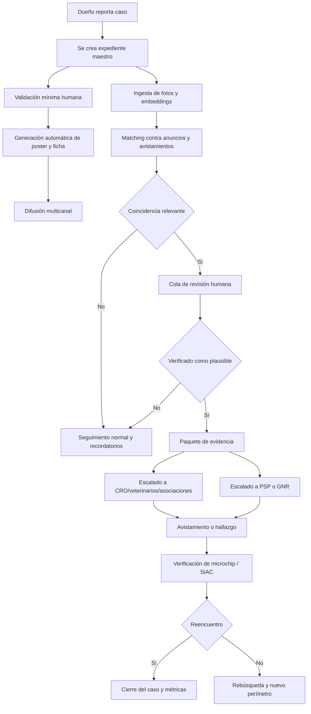

# Perros robados, abandonados y maltratados en el Algarve

## Resumen ejecutivo

El problema en el Algarve no es solo “perros perdidos”. Es una mezcla de **abandono, negligencia crónica, extravío, sustracción oportunista, reventa en anuncios, cría opaca y, en algunos casos, crueldad organizada**. En Portugal sí existen datos oficiales sólidos sobre **abandono/maus-tratos** y sobre la actividad de los **Centros de Recolha Oficial**, pero no aparece en las fuentes revisadas una serie nacional pública y periódica específica para **robo de perros** como categoría separada. Esa ausencia estadística es, en sí misma, una brecha operativa: lo que se mide bien en Portugal hoy es sobre todo abandono, maus-tratos y gestión municipal; el robo de perros queda diluido entre furto general, “animal desaparecido” y evidencia dispersa en redes, asociaciones y marketplaces. citeturn24search2turn35view0turn42view0

En el plano oficial portugués, el cuadro legal es relevante pero fragmentado. La **identificación electrónica y el registro en SIAC son obligatorios para perros, gatos y hurones**, y el propio régimen señala como objetivos **combatir el abandono** y **facilitar la recuperación de animales perdidos**. Además, Portugal regula la **venta de animales de compañía por Internet**: los animales pueden anunciarse online, pero la venta está limitada al local de cría o a establecimientos habilitados, y los anuncios deben contener información legal obligatoria, incluido el **número de criador/alojamiento con fins lucrativos**. Paralelamente, el **Código Penal** tipifica los **maus-tratos** y el **abandono** de animales de compañía; en 2024, el Tribunal Constitucional reafirmó la constitucionalidad del delito de maus-tratos del artículo 387.º. citeturn23search4turn22search2turn23search2turn46search3turn46search9turn28search19

En el Algarve, los mejores “proxies” oficiales muestran presión real. La GNR informó en 2025 que, en el acumulado 2022–2025 de abandono y maus-tratos a animales de compañía, **Faro** figuraba entre los distritos con más registos, tras Setúbal y Porto. A escala municipal, el informe anual de la DGAV sobre los CRO registró para 2025 actividad significativa en varios municipios algarvios: **Faro** reportó 178 animales recolhidos, 186 adoptados, 854 esterilizados, 13 eutanasiados y 578 vacunaciones antirrábicas; **Lagoa (Algarve)**, 253 recolhidos y 141 adoptados; **Lagos**, 66 recolhidos y 84 adoptados. En el caso de **Albufeira**, la DGAV recogió además actividad de un municipio sin CRO registrado, con 390 animales recolhidos y 221 adopciones comunicadas en 2025. citeturn4search13turn36view3turn37view3turn37view0

La conclusión práctica es clara: **la oportunidad de mayor impacto para un ingeniero de IA en el Algarve no está en “predecir el crimen”, sino en reducir el tiempo entre desaparición y recuperación, y en aumentar la trazabilidad cuando el robo deriva en venta o traslado**. Las intervenciones con mejor relación impacto/viabilidad combinan: **alerta distribuida muy rápida**, **matching visual de fotos**, **ingesta y empaquetado de evidencia**, **monitorización prudente de anuncios públicos**, **canal de avistamientos**, y **expediente listo para policía/MP/cámara/veterinarios**. Los casos internacionales más sólidos muestran que la tecnología funciona mejor como **acelerador de búsquedas humanas** que como sustituto de éstas. En EE. UU., **Petco Love Lost** ha reunido **250.000** mascotas; **PawBoost** afirma más de **2,2 millones** de reencuentros; y la evidencia ASPCA muestra que **49%** de los perros perdidos se recuperan gracias a la **búsqueda vecinal**, frente a solo **6%** encontrados en refugios. citeturn10search3turn26search0turn41search1

Mi recomendación, por tanto, es construir un **MVP de recuperación y trazabilidad** específico para el Algarve en 48–72 horas, no una “plataforma total”. Ese MVP debería empezar por cuatro módulos: **reporte estructurado del caso**, **poster y difusión multicanal**, **matching visual con shortlist humana**, y **dosier legal listo para denuncia**. En paralelo, conviene tejer una pequeña red piloto con **CROAF Faro**, asociaciones locales como **MAF**, **PRAVI Faro**, **LAPS Lagos**, **ADAP Portimão** y 5–10 clínicas veterinarias dispuestas a escanear microchip y reenviar hallazgos. citeturn6search19turn38search3turn10search2

## Problema, alcance y marco legal

### Qué problema conviene definir

Operativamente, conviene separar cinco flujos distintos, porque necesitan respuestas técnicas y jurídicas diferentes: **perro escapado**, **perro retenido por tercero “de buena fe”**, **robo oportunista**, **robo para reventa/cría**, y **maltrato/abandono estructural**. La literatura criminológica sobre pet theft destaca precisamente que “pet theft” agrupa motivaciones y circuitos distintos —uso propio, reventa, cría, ransom o tráfico— y que la falta de bases de datos específicas dificulta medir y combatir el fenómeno. En Europa, además, la Comisión Europea y varias ONG han señalado que la **venta online de perros y gatos** es una zona crítica donde confluyen bienestar animal, fraude documental y comercio ilegal. citeturn42view0turn27search1turn8search0turn8search1turn8search9

A nivel global, la Organización Mundial de Sanidad Animal subraya que el control poblacional canino debe perseguir simultáneamente **bienestar**, **reducción de animales errantes**, **tenencia responsable** y **control sanitario**. Esa visión importa porque en terreno real el robo, el abandono y la errancia se solapan: un perro mal identificado es más difícil de devolver; un perro robado puede terminar vendido; y un animal no recuperado puede acabar entrando en circuito de calle, rescate o reventa. citeturn7search6turn23search4

### Qué dicen los datos disponibles del Algarve y de Portugal

Portugal sí publica series útiles sobre el problema adyacente. En el comunicado de 2025 de la GNR, los **crimes de maus-tratos e abandono de animais de companhia** muestran una tendencia descendente respecto a 2022, pero siguen siendo de dimensión nacional relevante; además, la propia GNR situó a **Faro** entre los distritos con más registos acumulados entre 2022 y 2025. En la capa municipal, la DGAV reportó para 2025 **40.098 animales recolhidos**, **22.375 adoptados**, **43.165 esterilizados**, **1.814 eutanasiados** y **22.910 vacunados** en los CRO a nivel nacional reportado; esos números no miden robo, pero sí miden la presión del sistema de entrada/salida de animales vulnerables. citeturn24search2turn4search13turn47view0

En el Algarve, el **Centro de Recolha Oficial de Animais de Faro** informó en su segundo aniversario que, desde su apertura, había **devuelto 125 animales perdidos a sus familias**, un dato muy importante porque muestra que la recuperación efectiva existe cuando se combinan captura, custodia, identificación y comunicación. En el informe DGAV 2025, Faro volvió a reportar actividad intensa, y otros municipios algarvios como Lagoa y Lagos también muestran volúmenes materiales de recogida y adopción. La lectura más útil es que el Algarve ya tiene “nodos” institucionales donde una solución digital puede enchufarse sin inventar toda la cadena desde cero. citeturn6search19turn36view3turn37view3

Sobre animales errantes, el **Censo Nacional de Animais Errantes 2023** es una referencia clave, pero durante esta investigación el PDF oficial no fue fácilmente auditable en el navegador. Aun así, una iniciativa parlamentaria de 2025 que cita expresamente ese censo reproduce la cifra de aproximadamente **930.000 animales errantes** en Portugal continental, de los cuales unos **830.541 serían gatos** y **101.015 perros**. Dado que aquí esa cifra llega por fuente secundaria que cita el informe oficial, la trato como **estimación secundaria consistente**, no como dato primario directamente verificado línea a línea en esta revisión. citeturn6search2turn32search1

### Flujos típicos de caso

El flujo de mayor riesgo para un producto en el Algarve es: **desaparición o robo → circulación de alerta en grupos dispersos → eventual anuncio o traslado → hallazgo por tercero/veterinario/CRO → recuperación o pérdida de rastro**. Las fuentes sobre robo de mascotas apuntan a dos patrones especialmente relevantes para diseño preventivo y de búsqueda: en una muestra reciente de vídeo, la mayoría de los robos observados ocurrieron **de día**, muchos en **entornos residenciales**, con animales **visibles desde la calle** y a menudo en **espacios abiertos o poco protegidos**; en negocios, predominaban incidentes con el ladrón actuando como “cliente” o visitante. A la vez, el Pet Theft Taskforce británico y la literatura académica insisten en que la trazabilidad deficiente en la venta online hace posible que perros sustraídos se revendan a compradores ajenos al delito. citeturn47view1turn27search1turn42view0

Ese flujo se complica por la fragmentación digital. Los propietarios publican en grupos de Facebook, Instagram, WhatsApp, plataformas de animales perdidos, asociaciones y clínicas, pero **sin un caso maestro único**. Petco Love Lost, PawBoost y Pet FBI nacen justamente para resolver esa fragmentación: centralizar casos, empujar alertas, introducir matching y crear un circuito de retorno más corto. Esa es también la oportunidad más realista en el Algarve. citeturn10search0turn26search0turn25search1

### Marco legal portugués y brechas

El núcleo legal portugués útil para tu proyecto es el siguiente:

| Elemento | Qué establece | Relevancia práctica | Fuente |
|---|---|---|---|
| SIAC y microchip | Identificación y registro obligatorios para perros, gatos y hurones; objetivos: combatir abandono, promover bienestar y facilitar recuperación de animales perdidos | Base de verificación rápida cuando aparece un animal hallado o una disputa de titularidad | citeturn23search4turn22search2 |
| Venta online de animales | Se puede publicitar online, pero la compra/venta solo se admite en el local de cría o en establecimientos autorizados | Permite detectar anuncios sospechosos o no conformes | citeturn23search2turn23search8 |
| Requisitos del anuncio | Debe referir el número del criador/alojamiento; la legislación y documentos técnicos asocian además edad, identificación/marcación y datos de la camada/progenitores | Útil para reglas automáticas de “anuncio incompleto o irregular” | citeturn46search3turn46search9turn46search11turn46search14 |
| Municipios y CRO | Las câmaras municipais capturan perros y gatos errantes y los hacen recolher al CRO correspondiente | El CRO es un socio central del circuito de recuperación | citeturn35view0 |
| PSP | Programa de Defesa Animal con canal específico de denuncias/asesoramiento | Escalado urbano y recepción de denuncias | citeturn24search1 |
| GNR / SOS Ambiente e Território | Canal 24/7 para exponer situaciones que puedan violar legislación ambiental/territorial; la GNR actúa y comunica hechos al tribunal en casos de abandono | Escalado territorial y rural, muy relevante para Algarve | citeturn24search26turn24search12 |
| Código Penal | Los maus-tratos y el abandono de animales de compañía son delitos; el Tribunal Constitucional confirmó en 2024 la constitucionalidad del art. 387.º | Hay base penal para actuar frente a crueldad; para robo, se entra normalmente por la vía general del furto, no por un delito específico de “pet abduction” comparable al británico | citeturn28search19turn24search12 |

La principal **brecha legal-operativa** no es que “no exista ley”, sino que **no existe un circuito digital unificado de recuperación y evidencia**. Portugal tiene SIAC, CRO, PSP/GNR y reglas de anuncios; lo que falta, en la práctica, es una capa que **orqueste** esos elementos con buena prueba, rapidez y trazabilidad pública mínima. Además, a diferencia de Inglaterra e Irlanda del Norte, que crearon un **delito específico de pet abduction** tras el trabajo del Pet Theft Taskforce y SAMPA, en el ecosistema portugués revisado no aparece una figura equivalente para dar más visibilidad penal y estadística al robo de animales de compañía. Esa diferencia importa para la priorización policial y para la calidad del dato. citeturn7search0turn7search1turn28search19

## Casos de éxito y aprendizajes

### Comparativa de intervenciones útiles

| Caso | Lugar | Intervención | Tecnología / mecanismo | Resultado conocido | Escalabilidad | Alertas legales / éticas | Fuente |
|---|---|---|---|---|---|---|---|
| Encontra-me.org | Portugal | Base nacional de animales perdidos/encontrados; notificaciones por localización; revisión manual de anuncios | Base de datos, matching humano, flyers optimizados | Más de **178.000 anuncios** acumulados; el sitio afirma haber ayudado a reunir **miles** de animales desde 2005 | Alta para Portugal; muy buena base para integración o partnership | Evita fraude: recomienda no publicar microchip ni todos los rasgos identificadores | citeturn9search1turn9search7turn38search1 |
| FindMyPet de la OMV | Portugal | Punto de encuentro para animales perdidos; circuito cercano al ecosistema veterinario | Portal estructurado con casos cerrados | Flujo continuo de **casos recuperados**, incluidos varios en **Faro** en 2025 | Alta si se conecta a clínicas y OMV | Requiere buena moderación y datos verificables | citeturn10search2turn38search0turn38search2 |
| CROAF | Faro | Recuperación municipal por recolha, custodia, identificación y devolución a familias | Operación CRO + comunicación municipal | **125 animales devueltos a sus familias** desde el arranque del centro | Alta como socio piloto local | Requiere coordinación con asociaciones y SIAC | citeturn6search19turn6search1 |
| Petco Love Lost | EE. UU. | Plataforma gratuita nacional con photo-matching y centralización de casos | Reconocimiento visual, shelters partners, agregación | **250.000 mascotas reunidas** en 2026 | Muy alta; arquitectura replicable | Riesgo de sobreconfianza en IA si no hay validación humana | citeturn10search3turn10search0 |
| PawBoost | EE. UU. y otros mercados | “Amber alert” comunitaria con base de datos y difusión masiva | Alertas locales, shelters partners, matching humano-digital | Más de **2,2 millones** de reunificaciones; 48% de mascotas perdidas reportadas como reunidas; 80% de las reuniones dentro de 3 días, según datos autodeclarados | Muy alta | Métricas autodeclaradas; vigilar sesgos de cobertura | citeturn26search0turn26search13 |
| AKC Reunite Lost Pet Alert | EE. UU. | Broadcast geolocalizado a refugios, veterinarios y red local | Microchip + helpline 24/7 + email broadcast | 30 años de servicio y mecanismo formal de alerta local | Alta si existe red veterinaria | Depende de microchip y datos actualizados | citeturn10search1turn25search8turn10search13 |
| Ring Search Party | EE. UU. | Búsqueda comunitaria de perros perdidos apoyada en cámaras vecinales | IA sobre vídeo en red de cámaras Ring | Oficialmente, más de **un perro al día** recuperado desde el despliegue | Alta, pero dependiente de hardware y adopción | Privacidad y vigilancia; consentimiento del dueño de cámara es crítico | citeturn25search15turn25news39 |
| DogLost + SAMPA / Pet Abduction Act | Reino Unido | Base nacional + activismo legal | Red de voluntariado, coordinación pública, presión normativa | DogLost se presenta como la mayor base gratuita del Reino Unido; SAMPA logró la aprobación del **Pet Abduction Act** en 2024 | Alta en lo comunitario y normativa | Muy replicable como estrategia de incidencia, menos como producto cerrado sin partners | citeturn11search0turn7search1turn7search0 |

### Casos de éxito humanos, no solo tecnológicos

La evidencia más importante para una estrategia en el Algarve es que **las búsquedas humanas bien dirigidas siguen siendo decisivas**. En la encuesta ASPCA, **49%** de los perros perdidos fueron encontrados gracias a la **búsqueda del vecindario**, mientras que apenas **6%** aparecieron en refugios. Eso significa que tu producto no debe quedarse en “subir una foto”: debe activar barrio, clínicas, CRO, taxistas, carteros, limpieza urbana y negocios próximos. citeturn41search1

Las plataformas portuguesas ya incorporan esa lógica humana. Encontra-me recomienda explícitamente **folletos físicos**, **ocultar uno o dos rasgos identificadores para evitar fraude**, **avisar a clínicas veterinarias**, **notificar SIAC** y, si hubo sustracción, **presentar queixa-crime por furto** en PSP o GNR. Ese conjunto de pasos es exactamente el tipo de “playbook” que tu sistema debería convertir en flujos automáticos y checklists. citeturn38search1

También hay señales locales de éxito comunitario. El grupo público **“Animais: Perdidos e Achados - Algarve”** muestra actividad sostenida y publica actualizaciones semanales de reunificación, incluida una semana con **39 perros** y otra con **59 perros** reunidos con sus dueños, según sus propias publicaciones visibles. Es un dato comunitario, no una serie auditada, pero sí prueba que en el Algarve ya existe una masa crítica social que responde bien a alertas y sightings. citeturn44search8

Finalmente, los ejemplos recientes de Petco Love Lost no son solo “IA milagrosa”; son **IA + dueños persistentes + refugios + vecinos**. Casos como los de **Sandy**, localizada tras 33 días, o **Sweetie**, hallada a decenas de kilómetros, muestran que la IA funciona cuando agrega y filtra un paisaje digital fragmentado; no sustituye el trabajo de propietarios, shelters y ciudadanía. citeturn10search3turn26news40turn9news41

### Qué lecciones son transferibles al Algarve

La lección común de los casos exitosos es muy consistente:

- **La recuperación mejora cuando hay un “expediente maestro” único** y no 20 publicaciones dispersas. citeturn10search0turn26search0turn25search1
- **La comunidad local es más importante que el algoritmo** en las primeras 24–72 horas. citeturn41search1turn12search0turn12search1
- **La trazabilidad legal del anuncio** es una palanca potente en Portugal, porque la ley exige campos concretos. citeturn23search2turn46search3turn46search9
- **La integración con veterinarios y shelters/CRO** multiplica la tasa de retorno. citeturn10search1turn10search2turn6search19
- **La IA debe producir shortlists y alertas, no acusaciones**. citeturn14search8turn14search0turn29search8

## Opciones técnicas y stack MVP

### Qué enfoques de IA merecen la pena

La opción técnicamente más prometedora para el caso “mi perro ha sido robado o ha aparecido en un anuncio” es un sistema de **re-identificación visual** que combine **embeddings multimodales** y **vector search**. Modelos como **DINOv2**, **OpenCLIP** y **SigLIP** son buenos candidatos para extraer representaciones robustas de imagen; después, un vector DB como **Qdrant** o **pgvector** permite recuperar candidatos por similitud y filtrar por metadatos como municipio, fecha, sexo, tamaño o color declarado. La literatura específica de identificación animal confirma que el problema es de **open-set re-identification** y que el rendimiento cae cuando cambian fondo, iluminación, ángulo y distancia; por eso conviene usar el motor como **recuperador top-k** y no como clasificador final. citeturn14search3turn14search11turn15search0turn15search1turn15search2turn15search3turn14search8turn14search0

En un segundo nivel, puede añadirse un modelo más especializado en **cara de perro** o biometría animal. **DogFaceNet** fue un paso temprano útil, y el benchmark **PetFace** muestra que la identificación facial animal ya se puede estudiar a escala mucho mayor. Aun así, para un MVP realista en el Algarve yo no empezaría por un sistema cerrado de “dog face recognition” puro, porque muchas fotos de anuncios son pobres, no frontales y de calidad variable. Es más robusto empezar por **retrieval multimodal generalista** y, solo si el piloto demuestra corpus suficiente, pasar a un fine-tuning específico por razas/individuos. citeturn14search2turn14search8

Un tercer módulo muy útil es **detección y OCR de anuncios**. Los anuncios de venta suelen contener texto incrustado en imágenes, número de teléfono, palabras como “entrega”, “criador”, “vacinado”, “sem chip”, “MBWay”, o localizaciones útiles. Herramientas como **PaddleOCR** o **docTR** sirven para extraer ese texto; y un detector como **YOLO** ayuda a recortar el perro, identificar si hay múltiples animales, o separar overlays con texto del cuerpo del anuncio. citeturn16search0turn16search1turn16search13turn16search3turn16search11

Por encima de eso, conviene un módulo de **NLP/rules** para puntuar anuncios sospechosos. No hace falta un LLM caro al principio. En 48–72 horas alcanza con una combinación de **reglas explicables** y un pequeño clasificador multilingüe: anuncio sin número de criador, sin edad, lenguaje de urgencia (“hoje”, “entrega já”), texto ambiguo sobre raza, mención de cash/MBWay, cambios frecuentes de ubicación, o reutilización de fotos. Eso no “prueba robo”; solo prioriza revisión humana. Esta parte es recomendación técnica mía, apoyada por las exigencias legales del anuncio en Portugal y por la dificultad de trazabilidad señalada en la venta online. citeturn46search3turn46search9turn27search1

### Qué precisión esperar y cómo reducir falsos positivos

La expectativa razonable en un MVP no es “identificación automática fiable”, sino **aumento fuerte del recall en la fase de shortlist**. En la práctica:

| Enfoque | Valor principal | Expectativa realista | Riesgo principal | Mitigación recomendada |
|---|---|---|---|---|
| Embeddings visuales + vector search | Encontrar candidatos parecidos en anuncios/fotos de avistamiento | Bueno para **top-k** cuando hay fotos decentes y rasgos distintivos | Coincidencias entre perros similares de misma raza/color | Umbral alto + validación humana + doble confirmación por rasgos/geo/tiempo |
| Face-like dog recognition | Mejora si hay foto frontal y dataset local suficiente | Útil en algunos individuos, no universal | Sesgo por pose y calidad de imagen | Solo como señal secundaria |
| OCR en imágenes de anuncios | Extrae teléfono, texto incrustado, localización, edad, condiciones | Bastante útil y rápido | OCR erróneo en imágenes malas | Revisión de campos críticos antes de denunciar |
| NLP de anuncios sospechosos | Prioriza revisión | Bueno para triage, no para decisión final | “Criminalizar” lenguaje ambiguo o vendedores legítimos | Etiqueta “riesgo de irregularidad”, no “delito” |
| Clustering geográfico de avistamientos | Detecta focos y rutas | Muy útil para operasi ón y búsquedas | Datos ruidosos o falsos avistamientos | Pesar por credibilidad y densidad temporal |
| Detección de anomalías / grafos | Encontrar patrones de cuentas, teléfonos, fotos reutilizadas | Potente en fase 2 | Tratamiento de datos de posibles infractores | No crear listas negras públicas; remitir a autoridad | 

La literatura reciente sobre re-identificación canina en condiciones no controladas muestra precisamente que el contexto real —múltiples cámaras, baja calidad, fondos variables— degrada la identificación, y el benchmark PetFace refuerza que el problema es difícil incluso con datasets enormes. Por eso el principio rector debe ser: **“IA para sugerir; humano para decidir”**. citeturn14search0turn14search8turn43view1

### Requisitos de datos

Para un piloto funcional en el Algarve, tus datos mínimos deberían ser:

- **Caso maestro del dueño**: 3–8 fotos, fecha/hora/última localización, rasgos físicos, microchip SIAC si existe, sexo, esterilización, collar/arnés, comportamiento ante extraños, y si hay sospecha de robo o simple extravío.
- **Fotos de referencia normalizadas**: frontal, perfil, cuerpo completo, detalle de manchas/cicatrices, y, si se puede, vídeo corto.
- **Corpus de anuncios públicos**: URL, imágenes, texto OCR, teléfono/handle, fecha, localización declarada, plataforma.
- **Avistamientos**: ubicación aproximada, hora, foto/vídeo, dirección de movimiento, confianza del alertante.
- **Catálogo de partners**: veterinarios, asociaciones, CRO, voluntarios. citeturn38search1turn10search2turn6search1

### Cumplimiento RGPD y diseño prudente

Aquí el punto más importante es no convertir una herramienta de ayuda en una herramienta de **acusación privada**. Bajo el RGPD, si tu sistema procesa **datos personales** de anunciantes, testigos, vecinos o personas captadas en imágenes, necesitas una base jurídica; para un proyecto cívico de recuperación animal, la más plausible suele ser **interés legítimo** del responsable, siempre que superes el test de necesidad y balance. Además, debes aplicar **privacy by design** y, si haces monitorización sistemática y potencialmente extensa, una **DPIA** es muy aconsejable. citeturn29search0turn29search3

Hay un límite especialmente importante: el **artículo 10 del RGPD** restringe el tratamiento de datos relativos a infracciones penales. Traducido al producto: **no mantengas una base de “sospechosos” o “ladrones de perros”**, ni perfiles automatizados de personas etiquetadas como delincuentes. Mantén, en cambio, un **registro de evidencias del caso** y de coincidencias posibles, y deriva a PSP/GNR/MP cuando proceda. Eso te protege ética y jurídicamente. citeturn29search8

Si integras vídeos de cámaras domésticas o timbres inteligentes, debes ser aún más conservador. La CNPD recuerda que la videovigilancia en Portugal está sujeta al RGPD y a normas nacionales específicas; aunque un particular pueda aportar vídeo como prueba, tu sistema debería **recortar o difuminar caras y matrículas por defecto** antes de difusión comunitaria y reservar la versión íntegra al canal policial. citeturn29search2

### Stack recomendado para un MVP de 48–72 horas

Mi recomendación práctica para un MVP muy rápido es esta:

| Capa | Opción recomendada | Por qué |
|---|---|---|
| Frontend | **Next.js** desplegado en **Vercel** | Publicación rápida, formularios, panel básico; Vercel ofrece plan gratuito y Pro de bajo coste relativo para arrancar citeturn45search5turn45search1 |
| Backend | **FastAPI** o funciones serverless ligeras | Suficiente para colas, webhooks y scoring |
| DB operativa | **Supabase Postgres** | Auth, storage, SQL y posibilidad de pgvector en el mismo stack citeturn45search8turn45search16 |
| Vector search | **Qdrant Cloud free tier** o **pgvector** | Qdrant tiene free tier explícita; pgvector simplifica si quieres menos piezas citeturn45search2turn15search3 |
| Object storage | **Cloudflare R2** | Muy barato y sin egress fees; ideal para imágenes y derivados citeturn45search7turn45search19 |
| Embeddings imagen | **DINOv2** + **OpenCLIP/SigLIP** | Buen equilibrio entre robustez visual y búsqueda multimodal citeturn14search3turn15search0turn15search1 |
| Detección | **YOLO11/12** | Listo para producción y rápido para recorte/segmentación básica citeturn16search11turn16search19 |
| OCR | **PaddleOCR** o **docTR** | Buen soporte multilenguaje y rapidez de integración citeturn16search0turn16search1 |
| Reglas de riesgo | Python + regex + pequeño clasificador multilingüe | Mejor explicabilidad y menor coste inicial |
| Comms | Email primero; Telegram opcional; WhatsApp más adelante | Evita complejidad regulatoria/API en el primer sprint |

**Estimación de coste**: un MVP muy austero puede arrancar en **coste infra cercano a cero o decenas bajas al mes** usando free tiers; un piloto serio con almacenamiento de fotos, modesto volumen de inferencia y panel operativo suele encajar mejor en una banda inicial aproximada de **€150–€900/mes**, dominada por uso de compute/modelos y trabajo humano de moderación. Esta banda es una **inferencia de ingeniería** basada en los planes públicos de Vercel, Supabase, Qdrant y R2, no un presupuesto comercial cerrado. citeturn45search5turn45search4turn45search2turn45search7

## Diseño operativo y plantillas

### Flujo operativo recomendado



Este flujo convierte en software lo que hoy está repartido entre Encontra-me, FindMyPet, CRO, asociaciones y policía: una secuencia ordenada y rápida de **difusión, búsqueda, evidencia y escalado**. La lógica de folletos, notificación a clínicas, SIAC y denuncia en caso de sustracción está alineada con la guía operativa de Encontra-me y con los canales públicos existentes de PSP/GNR. citeturn38search1turn24search1turn24search26

### Flujos de usuario

**Flujo del dueño**
1. Reporta desaparición/robo.
2. Sube fotos y completa campos críticos.
3. El sistema genera poster, enlace público y checklists.
4. Recibe avisos de “coincidencia posible”, no “confirmada”.
5. Puede descargar un **dosier listo para denuncia**.

**Flujo de avistamiento**
1. Un vecino recibe poster o ve el caso.
2. Envía foto, hora y ubicación aproximada.
3. El sistema puntúa credibilidad y la incorpora al mapa operativo.
4. Si hay masa crítica de avistamientos, sugiere nuevo perímetro y socios a activar.

**Flujo de partner**
1. Veterinario/CRO/asociación recibe boletín diario de casos del radio local.
2. Si entra un perro hallado, escanea chip, consulta SIAC y busca coincidencias visuales/por descripción.
3. Si hay match plausible, se activa contacto con el responsable del caso. citeturn10search2turn23search4turn6search1

### Dosier de caso recomendado

El dosier debería tener dos versiones:

**Versión operativa**
- ID del caso
- Nombre del perro
- Estado: perdido / sospecha de robo / encontrado
- Última localización conocida
- Fotos de referencia
- Rasgos distintivos
- Collar/arnés
- Conducta con extraños
- Teléfono/email del responsable
- Historial de avistamientos
- Enlaces a posts y posters

**Versión legal**
- Identificación del titular
- Identificación electrónica SIAC si existe
- Cronología firmada
- URLs y capturas de anuncios relevantes
- Coincidencias visuales con timestamp
- Logs de comunicaciones
- Fotos/vídeos originales
- Lista de testigos
- Solicitud de diligencias mínimas: preservación de anuncio, identificación de anunciante, verificación de microchip, consulta de cámaras, contacto con CRO/vets

### Plantillas útiles

#### Poster

```text
PROCURA-SE / POSSÍVEL ROUBO

Nome: [NOMBRE]
Raça/tipo: [RAZA O “rafeiro”]
Sexo: [M/F] | Esterilizado: [sí/no]
Última vez visto em: [LUGAR]
Data/hora: [FECHA Y HORA]

Sinais distintivos:
- [mancha, cicatriz, cor da coleira]
- [comportamento com estranhos]

Se o vir:
- NÃO tente agarrá-lo se estiver assustado
- Tire foto/vídeo se for seguro
- Indique localização exata e direção

Contacto: [TELÉFONO]
Caso: [URL corta / QR]
Recompensa: [opcional]

Nota: por segurança, nem todos os dados identificativos são públicos.
```

#### Email de denúncia

```text
Assunto: Suspeita de furto / paradeiro de animal de companhia – [Município] – [Data]

Exmos. Senhores,

Venho comunicar factos relativos ao desaparecimento/suspeita de furto do meu animal de companhia:

Titular: [NOME]
Contacto: [TEL/EMAIL]
Animal: [DESCRIÇÃO]
Microchip/SIAC: [NÚMERO, se aplicável]
Última localização e hora: [DETALHE]
Circunstâncias do desaparecimento: [RESUMO]

Anexo:
1. Fotografias do animal
2. Cronologia factual
3. Capturas/links de anúncios ou publicações potencialmente relacionadas
4. Elementos de testemunhas/avistamentos
5. Outros meios de prova

Solicito, se entendido adequado, a preservação dos elementos digitais identificados, a verificação do eventual microchip e o encaminhamento processual cabível.

Com os melhores cumprimentos,
[NOME]
```

#### Formulario de avistamiento

```text
AVISTAMENTO

Caso ID:
Data/hora:
Localização aproximada:
Foto/vídeo anexado: [sim/não]
Confiança do alertante: [alta/média/baixa]
Viu o animal parado ou em movimento?
Direção:
Parecia ferido?
Tentou aproximar-se? O que aconteceu?
Observações adicionais:
Contacto do alertante:
```

### Reglas de moderación y anti-doxxing

- Nunca publicar **nome completo, morada, matrícula ou número de telefone** de um alegado vendedor sem validação jurídica/policial.
- Nunca mostrar o **número de microchip completo** em posters públicos. Encontra-me recomenda precisamente ocultar identificadores e um ou dois traços distintivos para evitar fraude. citeturn38search1
- Etiquetas públicas permitidas: **“animal perdido”**, **“possível correspondência”**, **“anúncio potencialmente irregular”**.
- Etiquetas públicas prohibidas sem decisão humana forte: **“ladrão”**, **“traficante”**, **“ilegal confirmado”**.
- Toda coincidencia debe ser revisada por una persona antes de difundirla fuera del equipo.

## Monitorización, riesgos y gobernanza

### Plataformas prioritarias en el Algarve

| Plataforma | Prioridad | Qué vigilar | Nota legal / TOS | Recomendación operativa | Fuente |
|---|---|---|---|---|---|
| OLX Portugal | Muy alta | Anuncios de perros en Faro/Algarve; duplicados; ausencia de datos legales; reutilización de fotos | OLX permite categoría de animales y remite al cumplimiento de la Ley 95/2017; no identifiqué en las fuentes revisadas una autorización clara para scraping masivo | Para MVP: monitorización manual o semiautomática muy prudente; idealmente con permiso o vía reporte de usuarios; reglas sobre campos obligatorios | citeturn21search2turn21search9turn21search11 |
| CustoJusto | Alta | Cães/animais en Faro; teléfonos/locations; textos de urgencia | Plataforma pública activa en Faro; términos consultados definen reglas del sitio, pero no emergió autorización expresa para scraping libre | Igual que OLX: prioridad alta, pero con enfoque de user-submitted URLs + revisión humana | citeturn19view1turn44search0turn44search3turn44search7 |
| Facebook Marketplace | Alta para riesgo, baja para crawling | Venta encubierta y desvío a DM | Meta prohíbe en Commerce content la compraventa o intercambio de animales; además, sus TOS prohíben recolectar información de modo automatizado sin permiso | No crawlear en MVP; usar reportes ciudadanos, búsqueda manual y captura de pantalla; gran valor como fuente de leads | citeturn21search0turn21search3turn18search0turn18search2 |
| Grupos públicos de Facebook del Algarve | Muy alta | Perdidos/achados, sightings, reencuentros, avisos locales | Mismo régimen Meta sobre automatización; operan como tejido comunitario muy útil | Relación prioritaria con admins; ingestión por formulario/URL, no scraping agresivo | citeturn44search1turn44search8turn18search0 |
| Instagram público | Media | Reels/post con perros “para adoção/venda”, stories republicadas, cuentas de rescate | TOS de Instagram prohíben acceso o recolección automatizada sin permiso expreso | Búsqueda manual/por partners al inicio; no depender de crawling | citeturn18search0turn18search2 |
| TikTok | Media-baja | Contenido viral local y reventas informales | No dispongo aquí de fuente oficial auditada en navegador, pero las políticas públicas recientes van en dirección restrictiva para scraping; tratar con cautela | Dejar para fase 2, salvo aportes de usuarios | |
| Encontra-me / FindMyPet / Pet Alert Portugal | Muy alta para recuperación | Coincidencias con perros hallados y nuevas alertas | Son plataformas legítimas de recuperación; el uso debe respetar sus términos y finalidad | Priorizar partenariat e ingestión consentida antes que crawling | citeturn9search7turn10search2turn39search0 |

Las dos decisiones fuertes aquí son: **no empezar por scraping agresivo de Meta** y **sí empezar por URLs, capturas y alertas aportadas por usuarios/partners**. En Meta, la prohibición de recogida automatizada sin permiso es explícita, y en Marketplace además la propia venta de animales ya contraviene Commerce Policies. En OLX/CustoJusto, el problema no es solo TOS; también conviene ajustar la monitorización al marco legal portugués de anuncios de animales, usando la IA primero para **detectar irregularidad de anuncio** y no para “investigar personas”. citeturn18search0turn18search2turn21search0turn23search2turn46search3

### Arquitectura de monitorización recomendada

Para el Algarve haría una arquitectura de tres carriles:

**Carril de reporte**
- Formulario web del dueño.
- Canal de avistamiento.
- Inbox de correo para veterinarios/asociaciones.
- Carga de URLs y capturas de anuncio por la comunidad.

**Carril de observación pública**
- Revisiones periódicas de OLX/CustoJusto en categorías de perros de Faro/Algarve.
- Búsquedas manuales en grupos públicos relevantes del Algarve.
- Partners que envían links sospechosos.

**Carril de matching**
- OCR y extracción de metadatos.
- Recorte del perro con detector.
- Embeddings de imagen.
- Búsqueda vectorial.
- Reglas de similitud + score geotemporal.
- Cola humana de verificación.

### Cadencia y umbrales sugeridos

Esto ya es recomendación operativa mía, no regla legal:

- **Casos nuevos**: publicar en menos de **10 minutos** desde creación.
- **Revisión de marketplaces**: cada **2–4 horas** en horario diurno.
- **Grupos públicos y partners**: digest cada **mañana**, revisión manual adicional por la tarde.
- **Umbrales de alerta**:
  - score visual **>0,85** y consistencia temporal/geográfica → alerta humana prioritaria,
  - **0,70–0,85** → triage,
  - **<0,70** → solo log.
- **Nunca** enviar notificación automática a comunidad acusando a una persona; solo “posible coincidencia”.

### Riesgos, ética y modelo de gobernanza

Los riesgos reales no son abstractos; son muy concretos:

- **Falsas acusaciones** contra un anunciante o un particular que recogió un perro de buena fe.
- **Vigilantismo** y doxxing.
- **Uso secundario** del sistema para acoso vecinal o disputas privadas.
- **Retención excesiva** de datos personales.
- **Procesamiento indebido de datos sobre infracciones**. citeturn29search8turn29search3turn29search0

Mi recomendación es un modelo de gobernanza simple pero serio:

| Componente | Recomendación |
|---|---|
| Responsable del tratamiento | Entidad clara: asociación, fundación o startup social con política de privacidad visible |
| Base jurídica | Interés legítimo documentado; DPIA desde fase piloto |
| Comité de revisión | 1 técnico, 1 perfil operación animal, 1 asesor legal/privacidad |
| Política de publicación | Solo casos, sightings y posibles matches; nunca acusaciones nominales |
| Retención | Casos cerrados: minimizar, archivar y purgar en plazos definidos; evidencias penales, solo si hay denuncia o consentimiento adecuado |
| Auditoría | Log de quién vio, validó y escaló cada coincidencia |
| Salvaguardas | Difuminado por defecto de caras/matrículas; acceso restringido a material original |

## Hoja de ruta, costes y recomendaciones

### Fase inmediata

**Objetivo**: lanzar un piloto funcional del Algarve en 48–72 horas.

**Entregables**
- Formulario de reporte de perro perdido/robado.
- Expediente maestro.
- Generador de poster.
- Enlace público de caso.
- Carga de sightings.
- Matching visual básico sobre fotos subidas y un pequeño corpus de anuncios/capturas.
- Descarga de dosier legal.
- Lista de partners locales. 

**Equipo mínimo**
- 1 full-stack/ML engineer.
- 1 responsable de operaciones/moderación a tiempo parcial.
- 1 asesor legal/privacidad unas pocas horas.
- 3–5 voluntarios para difusión y validación local.

### Fase de consolidación

**Horizonte**: 1–3 meses.

**Entregables**
- Ingesta semiautomática de OLX/CustoJusto permitida por revisión jurídica y técnica.
- Panel de métricas.
- Heatmap de sightings.
- Catálogo de clínicas y CRO integrados.
- Sistema de “watchlist” de casos por municipio.
- Revisión humana escalonada.
- Plantillas multilingües ES/PT/EN para el Algarve.

### Fase de ampliación

**Horizonte**: 3–12 meses.

**Entregables**
- Partnership formal con 1–3 municipios.
- Protocolo con clínicas veterinarias y shelters.
- Training/fine-tuning con dataset local anonimizado, si la base crece.
- Motor de irregularidades de anuncios.
- API para partners.
- Informe anual de impacto y policy brief para Portugal.

### Presupuesto orientativo y KPIs

| Concepto | MVP | Piloto 3 meses | Comentario |
|---|---:|---:|---|
| Infra base | €0–€100/mes | €100–€400/mes | Free tiers o planes básicos de Vercel/Supabase/Qdrant/R2 pueden cubrir el arranque citeturn45search5turn45search4turn45search2turn45search7 |
| Inferencia / embeddings | €20–€300/mes | €100–€600/mes | Depende de volumen de imágenes y si usas servicios externos |
| Moderación / ops | muy variable | principal coste | El cuello de botella real será humano, no solo técnico |
| Asesoría legal / privacidad | puntual | puntual/retainer | Muy recomendable desde el piloto |

**KPIs de impacto**
- Tiempo medio desde reporte hasta publicación.
- Tiempo medio hasta primer avistamiento creíble.
- Número de sightings por caso.
- Porcentaje de casos con al menos una coincidencia visual útil.
- Tasa de reencuentro.
- Tiempo medio de reencuentro.
- Porcentaje de casos con microchip/SIAC actualizado.
- Tasa de falsos positivos de matching.
- Número de expedientes escalados a CRO/veterinarios/policía.
- Número de anuncios potencialmente irregulares detectados y validados. 

### Qué construiría yo primero si estuviera en tu sitio

Si tu objetivo es “mi granito de arena, pero útil”, yo construiría este orden:

**Primero**
Un producto llamado, por ejemplo, **Algarve Dog Recovery**: caso maestro, poster, sightings, panel mínimo y dosier legal. Esto ya aporta valor inmediato aunque la IA aún sea modesta.

**Después**
Un motor de matching visual y OCR que trabaje sobre:
- fotos subidas por dueños,
- fotos de anuncios aportadas por la comunidad,
- perros hallados por vets/CRO/asociaciones.

**Tercero**
Una red local cerrada de 20–30 partners: CROAF, asociaciones de Faro/Lagos/Loulé/Portimão/Tavira, y clínicas. En esta categoría, las fuentes revisadas permiten empezar por **CROAF**, **MAF**, **PRAVI Faro**, **LAPS Lagos**, **Animal Aid / SOS Algarve Animals**, **ADAP Portimão** y los contactos veterinarios ligados a OMV/FindMyPet. citeturn6search1turn38search3turn10search2

**Cuarto**
Si el piloto genera casos suficientes, sí tiene sentido entrenar o ajustar un modelo específico local con mejores embeddings para perros del Algarve. Antes de eso, no.

### Mensaje de outreach sugerido

```text
Estamos a lançar um piloto no Algarve para reduzir o tempo entre o desaparecimento de um cão e o seu regresso a casa.

O sistema não faz acusações públicas. Organiza o caso, gera posters e alertas, recolhe avistamentos, cria um dossier pronto para as autoridades e ajuda a encontrar correspondências visuais em anúncios ou fotos enviadas pela comunidade.

Procuramos 3 tipos de parceiros:
- clínicas veterinárias que aceitem receber alertas locais e confirmar microchip;
- associações/CRO que queiram testar um fluxo comum de casos;
- administradores de grupos locais de animais perdidos/achados.

Objetivo: menos dispersão, mais prova útil e mais reencuentros.
```

## Limitaciones y preguntas abiertas

La limitación principal de esta investigación es que, aunque hay **buena base oficial portuguesa** para abandono, maus-tratos, SIAC, CRO y regulación de la venta online, **no encontré una serie oficial nacional específica y regular sobre robo de perros en Portugal**. Eso obliga a trabajar con proxies institucionales y con literatura internacional sobre pet theft. citeturn24search2turn35view0turn42view0

También hay un límite técnico-jurídico relevante: para redes sociales de Meta, las **TOS públicas son restrictivas frente a la automatización**, así que un MVP responsable debería apoyarse más en **user-submitted evidence**, partnerships y revisión humana que en crawling agresivo. citeturn18search0turn18search2

Las preguntas abiertas de mayor valor para un piloto son tres:

1. **¿Qué tasa real de robo/reventa existe en el Algarve**, separada de extravío y abandono?
2. **¿Qué partners locales** —CRO, vets, asociaciones, admins de grupos— aceptarían compartir casos o recibir alertas estructuradas?
3. **¿Cuánto mejora la tasa de recuperación** al introducir un expediente maestro + difusión + matching visual frente al flujo actual disperso?

Si el piloto responde bien a esas tres preguntas, ya tendrás la base para una herramienta con impacto real, medible y defendible.